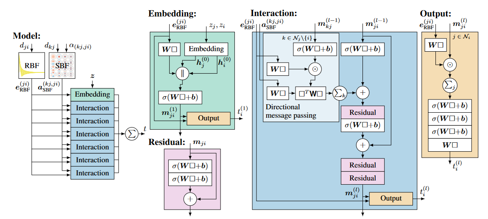
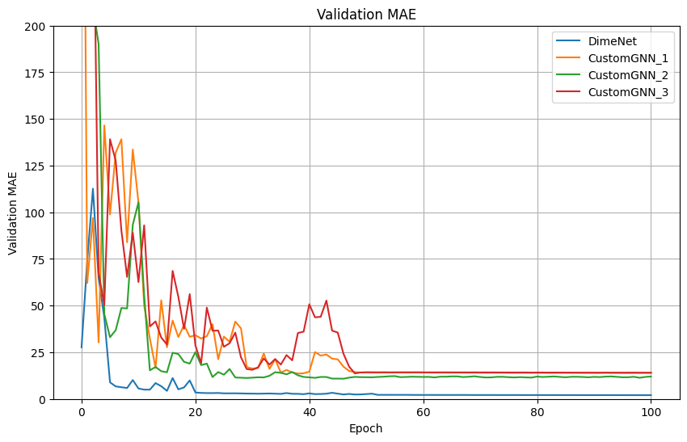
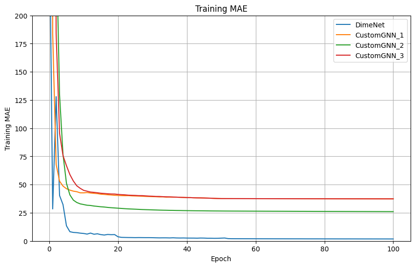

# Estimating Atomization Energies in the QM7 Dataset using Machine Learning

## Problem Statement

In this task, we aim to estimate the atomization energies of molecules in the QM7 dataset using various machine learning techniques. 

### Dataset Overview

- **Origin**: Subset of GDB-13, a database of nearly 1 billion stable and synthetically accessible organic molecules.
- **Composition**: 7,165 molecules with up to 23 atoms (7 heavy atoms from elements of C, N, O, S).
- **Features**:
  - **Coulomb Matrix Representation**: 
    - Diagonal elements: $ C_{ii} = \frac{1}{2}Z_i^{2.4} $
    - Off-diagonal elements: $ C_{ij} = \frac{Z_iZ_j}{|R_i - R_j|} $
    - Invariance: Built-in invariance to translation and rotation.
  - **Atomization Energies**: Ranging from -800 to -2000 kcal/mol.

- **Data Format**:
  - **X (7165 x 23 x 23)**: Coulomb matrices (input features).
  - **T (7165)**: Atomization energies (labels).
  - **P (5 x 1433)**: Cross-validation splits.
  - **Z (7165 x 23)**: Atomic charges.
  - **R (7165 x 3)**: Cartesian coordinates of each atom.

### Prior Work

Previous studies [1] and [2] have focused on learning the mapping between molecules and their atomization energies using the Coulomb Matrix (CM) as a molecular descriptor. Specifically, [2] builds on [1] by comparing several methods to enforce permutation invariance in the features:

1. **Sorted Eigenspectrum**: Computing the sorted eigenvalues of the CM.
2. **Sorted Rows and Columns**: Sorting the rows and columns of the CM by their respective norms.
3. **Random Sorting**: Augmenting the dataset by randomly sorting rows and columns to associate multiple Coulomb matrices with each molecule.

### Goals of the Current Study

1. **Replication**: Replicate the results of [2] by using the described permutation invariance methods with surveyed machine learning methods.
2. **Exploration of GNN**: Explore the use of Graph Neural Networks (GNNs) to learn from the raw representation of molecules as Cartesian coordinates and associated atomic charges.

### CM Features

#### Sorted Eigenvalues

Given a Coulomb matrix $ \mathbf{C} $, we have:
$$ \mathbf{C} \mathbf{v}_i = \lambda_i \mathbf{v}_i $$
where $ \lambda_i $ are the eigenvalues and $ \mathbf{v}_i $ are the corresponding eigenvectors. The eigenvalues are then sorted in descending order to form the feature vector:
$$ \text{sorted\_eigenvals}(\mathbf{C}) = \text{sort}(\{|\lambda_1|, |\lambda_2|, \ldots, |\lambda_n|\}) $$

These sorted eigenvalues could be used to represent molecules as they capture important properties of the matrix, and is invariant to permutation of atoms (i.e of rows and columns). 

However, the eigenvalues are not unique for each molecule. Consider the following two matrices:

$$ \mathbf{A} = \begin{pmatrix} 2 & 1 \\ 1 & 2 \end{pmatrix}  \mathbf{B} = \begin{pmatrix} 3 & 0 \\ 0 & 1 \end{pmatrix}$$

, which have the same eigenvalues of:

$$ \lambda_1 = 3, \quad \lambda_2 = 1 $$

<!-- Proof of invariant to permutation. Permute Matrix and SVD probably -->

#### Sorted Coulomb Matrices

For a Coulomb matrix $ \mathbf{C} $ with rows $ \mathbf{C}_i $:
$$ \left\|\mathbf{C}_i \right\| = \sqrt{\sum_{j} C_{ij}^2} $$
As $ \mathbf{C} $ is symmetric, both rows and columns are then sorted by the norm values in descending order for a unique representation for each molecule. 

<!-- Proof of unique representation for each molecule. Induction. -->

#### Randomly Sorted CM

With a Coulomb matrix $ \mathbf{C} $ and row norms $ \left\|\mathbf{C}_i \right\| $, we add noise to the norms before sorting to get different permutations:
$$ \left\|\mathbf{C}_i \right\|' = \left\|\mathbf{C}_i \right\| + \text{noise} $$
$$ \pi' = \text{argsort}(-\left\|\mathbf{C}_i \right\|') $$
Apply this permutation to rows and columns of $ \mathbf{C} $:
$$ \text{random\_C}_{ij} = \mathbf{C}_{\pi'(i) \pi'(j)} $$

This method aims to augment the dataset with advantage such that to unlearn pattern associated with sorting i.e the order in which atoms are listed.

## Classical ML Methods

### K-Nearest Neighbor

The K-Nearest Neighbor (KNN) algorithm is a non-parametric method used for regression. It predicts the target value of a new sample based on the mean (or mode) of the k-nearest neighbors in the training set.

For a given query point $ x $, the predicted atomization energy $ \hat{y} $ is given by:
$$ \hat{y} = \frac{1}{k} \sum_{i \in \mathcal{N}(x)} y_i $$
where $ \mathcal{N}(x) $ represents the set of k-nearest neighbors of $ x $ and $ y_i $ is the target value of neighbor $ i $.

### Linear Regression

Linear Regression assumes a linear relationship between the input features and the target variable.

$$ \hat{y} = \mathbf{X} \mathbf{w} + b $$
where $ \mathbf{X} $ is the feature matrix, $ \mathbf{w} $ is the weight vector, and $ b $ is the bias term.

### Kernel Ridge Regression

Kernel Ridge Regression (KRR) combines Ridge Regression with kernel trick, allowing it to perform in higher-dimensional space defined by the kernel.

It solves the following optimization problem:
$$ \min_{\mathbf{w}} \left( \sum_{i=1}^N (y_i - \mathbf{w}^T \phi(x_i))^2 + \alpha \|\mathbf{w}\|^2 \right) $$
where $ \phi(x) $ is the feature mapping function of the kernel, $ \alpha $ is the regularization parameter, and $ \|\mathbf{w}\| $ is the norm of the weight vector. We use Radial Basis Function for $ \phi(x) $ in this task.

#### Radial Basis Function (RBF) Kernel
The RBF kernel is defined as:
$$ K(x, x') = \exp\left(-\frac{\|x - x'\|^2}{2\sigma^2}\right) $$
where $ \|x - x'\| $ is the Euclidean distance between two points and $ \sigma $ is a free parameter. The RBF kernel is known for its ability to handle non-linear relationships.

### Support Vector Regression

Support Vector Regression (SVR) uses the principles of Support Vector Machines to perform regression, balancing model complexity with the tolerance for errors within a certain margin.

The optimization problem is stated as follow:
$$ \min_{\mathbf{w}, b, \xi, \xi^*} \frac{1}{2} \mathbf{w}^T \mathbf{w} + C \sum_{i=1}^N (\xi_i + \xi_i^*) $$
subject to:
$$ y_i - (\mathbf{w}^T \phi(x_i) + b) \leq \epsilon + \xi_i $$
$$ (\mathbf{w}^T \phi(x_i) + b) - y_i \leq \epsilon + \xi_i^* $$
$$ \xi_i, \xi_i^* \geq 0 $$
where $ \phi(x) $ is the feature mapping, $ \epsilon $ is the margin of tolerance, $C$ is regularization parameter, and $ \xi, \xi^* $ are slack variables. We also use Radial Basis as kernel function in this task.

## Results

Input to all models are preprocessed with `StandardScaler()` in a pipeline. We apply grid search for the optimal parameters using the five predefined stratified folds in the dataset. The results for each type using sorted eigenvalues and sorted coulomb matrices feature are shown below:

**Sorted Eigenvalues**

| Model                   | Mean Absolute Error (MAE) |
|-------------------------|---------------------------|
| Linear Regression       | 29.08                      |
| K-Neighbors Regression(n_neighbors=3, p=1, weights='distance')       | 12.67                      |
| Kernel Ridge Regression (alpha=0.0004, gamma=0.01, kernel='rbf') | 10.07                      |
| Support Vector Regression (C=1000.0, epsilon=1.0) | 9.98                    |

While the effective ranking generally agree with [2], the performance of Linear Regression and particularly K-Neighbors Regression is surprisingly high.

**Sorted Coulomb Matrices**

| Model                   | Mean Absolute Error (MAE) |
|-------------------------|---------------------------|
| Ridge Regression (alpha=50.0)      | 32.54                      |
| K-Neighbors Regression (n_neighbors=3, p=1, weights='distance')       | 22.48                      |
| Kernel Ridge Regression (alpha=0.0001, gamma=0.0001, kernel='rbf') | 15.03                      |
| Support Vector Regression (C=1000.0, epsilon=1.0) | 15.70                    |

Here, we specifically want to note the results for kernel methods with sorted CM are very different from [2]. 

## Multi-Layer Perceptron

### Architecture Overview 

In this section, we describe the architecture of our MLP to estimate atomization energies from the QM7 dataset adapted to different features. Thus, it comprises three main components: the input preprocessor, the multi-layer perceptron (MLP), and the output postprocessor.

#### Input Preprocessor

The input preprocessors transform the input Coulomb Matrix into chosen feature (Sorted Eigenvalues, Sorted Coulomb Matrices, Randomly Sorted Coulomb Matrices). The logic of the three transformations has been explained above. We also normalize the feature with mean and standard deviation calculated from the training set. 

However, for Randomly Sorted Coulomb Matrix, we apply an additional step of expanding the matrix into binarized features by applying a series of hyperbolic tangent functions at regular intervals as explained in [2]:
$$
x=\left[\ldots, \tanh \left(\frac{C-\theta}{\theta}\right), \tanh \left(\frac{C}{\theta}\right), \tanh \left(\frac{C+\theta}{\theta}\right), \ldots\right]
$$
 with number of steps being $C_{\max} / \theta$ and $\theta = 1$ . 

#### Core Network

The core of the model is a typical Multi-Layer Perceptron (MLP) that maps the processed input features to the predicted atomization energies. We use two hidden layers composed of 400 and 100 units with sigmoid activation functions to introduce non-linearity similar to [2].

#### Output Postprocessor

The output postprocessor transforms the network's raw output back to the original scale. The params are determined during layer initialization using the mean and standard deviation of the target values from the training set.

#### Training Process

We again use the predefined folds in the dataset for training the MLP with Adam optimizer and Mean Absolute Error Loss. 

We decide not to interact with the validation set during training and instead use the training loss for learning rate scheduler and early stopping callback. While this carries the risk of overfitting, we are allowed to report validation as test result in return. Nevertheless, we note the common alternative approach of creating a separated validation set from the predefined training. 

### Result

Due to time constraint, we are only able to report result on training of fold 0 of the QM7 dataset. The train and validation loss with respect to epoch are shown below:

| Model                  | TEST_MAE | TEST_RMSE |
|------------------------|----------|-----------|
| Randomly Sorted CM   | 4.6658   | 6.7774    |
| Sorted CM          | 8.7802   | 12.5981   |
| Sorted Eigenvalues       | 10.1371  | 13.8153   |

The results generally agrees with result of [2], with sorted eigenvalues approach and sorted coulomb matrices achieved slightly better result but randomly sorted Coulomb matrices had slightly worse. This is likely due to the differences in the training process like different loss function, optimizers, or tuning of learning rate.

### Graph Neural Networks

We implemented Graph Neural Network for molecule atomization energy prediction using the PyTorch Geometric framework.

#### Data

In the GNN approaches, we extract feature from the molecular structure instead of the Coulomb matrix. In other words, we use the positional and charge information from the dataset. Specifically, we store the charge info in `data.pos`, the Cartesian coordinate in `data.pos`, and charge value concatenated with its one-hot encoding in the feature attribute `data.x`. 

We use custom transformations dynamically create edge indices and other features for inputs to the graph neural network. Below are some representative transformations:

**PruneZeroCharge**

For GNN, the number of atom i.e nodes in the input graph is not required to be uniform. Thus we could try removing (padding) atoms with zero charge from the molecular graph, focusing on only atoms that contribute to the property being predicted.

**KNNGroupWithPos**

We construct the edge indices of the molecular graph using k-nearest neighbors (kNN) based on the positional information of the atoms `data.pos` instead of the default feature attribute `data.x`.

**CoulombGroupTransform**

We compute the pairwise Coulomb forces between atoms and and add them as edge attributes. We also constructs the graph inputs based on the k-largest forces.

### Custom GNNs

#### Convolutional Layer
The custom GNNs share a simple convolution layer design designed to handle node features, positional information, and optionally, edge attributes. 

**Initialization**

The `CustomConvLayer` inherits from `pyg_nn.MessagePassing` and is initialized with the following parameters:
- **`in_channels`**: The number of input features for each node.
- **`out_channels`**: The number of output features for each node after the convolution.
- **`pos_dim`**: The dimensionality of the positional information (default is 3 for 3D positions).
- **`edge_dim`**: The dimensionality of the edge features (default is 0, indicating no edge features).

- The aggregation scheme is set to 'add', one of the main option for `pyg_nn.MessagePassing`. It will sum the messages from neighboring nodes into the new features of output graph:
$$
x_i^{(l+1)} = \sum_{j \in \mathcal{N}(i)} \boldsymbol{m}_{ji}
$$
- A simple MLP (multi-layer perceptron) is defined with two linear layers and a ReLU activation in between. The input to the MLP is a concatenation of the features of the connected nodes and their positional info (and edge features if provided).

**Forward Function**
The `propagate` function is called, which handles the message passing mechanism. 

**Message Function**

It constructs the messages to be passed along the edges during the propagation step. For each edge, the features and position difference of the source node (`x_j`, `pos_j`) and the target node (`x_i`, `pos_i`) are used:
$$
\boldsymbol{m}_{ji} = \text{MLP}([x_i, x_j, pos_j - pos_i])
$$

If `pos_dim` is set to 1, the Euclidean distance between the nodes is computed and used instead of the positional difference.

$$
\boldsymbol{m}_{ji} = \text{MLP}([x_i, x_j, |pos_j - pos_i|])
$$

The features of the connected nodes and their positional differences (or distance) are concatenated to form the edge feature. The concatenated edge feature is then passed through the MLP to produce the final message.

#### GNNs

The main difference between the three versions of **CustomGNN_1** is in the graph processing component.

**CustomGNN_1**

This model uses `CustomConvLayer` layers, passing graph data sequentially.

**CustomGNN_2**

This model uses a list of `CustomConvLayer` layers, each processed input in parallel. This is analogous to different filters in CNN architecture. The outputs of these convolutional layers are then concatenated.

**CustomGNN_3**

In addition to processing data sequentially like version 1, it also stacks and then averages the outputs of each layers into the output of the graph component.

**Predictor Head**

Global Sum Pooling is applied at the end of the graph component. The data is then passed into a MLP predictor head that processes the pooled features and produce the final output.

The dimension of all linear layers are controlled with only the `hidden_layer` parameter. 

### DimeNet
<!-- https://pytorch-geometric.readthedocs.io/en/latest/_modules/torch_geometric/nn/models/dimenet.html#DimeNet -->
In addition to implementing simple GNNs, we also investigate state-of-the-art architectures for this task. Notably, J. Gasteiger et al. introduced DimeNet and the improved DimeNetPlusPlus models in their works [3] and [4].

### Architecture Overview

#### Input

The input consists of positional information (`pos`) and atomic numbers (`z`).

#### Graph Creation

Edges are created based on the positional information using a cutoff distance. For more details, refer to `demo.ipynb`.

#### Radial Basis Functions (RBF) and Spherical Basis Functions (SBF)
<!-- 
https://en.wikipedia.org/wiki/Bessel_function#Spherical_Bessel_functions
https://en.wikipedia.org/wiki/Helmholtz_equation#Three-dimensional_solutions

https://en.wikipedia.org/wiki/Laplace%27s_equation#Laplace's_spherical_harmonics 
-->
Radial Basis Functions (RBFs) and Spherical Basis Functions are used to transform the positional information. 

In the new (frequency) basis, the network can represent the physics of interactions in the form that is more easily captured through linear transformations. Specifically, it is the natural basis for the solution of time-independent wave equation (Helmholtz Equation) in spherical coordinates. 

#### Custom Message Propagation

DimeNet employs a custom message creation and aggregation scheme for directional message passing i.e not inherited from `pyg_nn.MessagePassing`. The method also considers the angular relationship between neighboring nodes in addition to the distance:

$$
\boldsymbol{m}_{ji}^{(l+1)} = f_{\text{update}}\left(\boldsymbol{m}_{ji}^{(l)}, \sum_{k \in \mathcal{N}_j \backslash \{i\}} f_{\text{int}}\left(\boldsymbol{m}_{kj}^{(l)}, \boldsymbol{e}_{\mathrm{RBF}}^{(ji)}, \boldsymbol{a}_{\mathrm{SBF}}^{(kj, ji)}\right)\right)
$$

- $\boldsymbol{m}_{ji}^{(l+1)}$: Updated message from node $j$ to node $i$ at layer $l+1$.
- $f_{\text{update}}$: Update function combining the current message with the aggregated messages.
- $\sum_{k \in \mathcal{N}_j \backslash \{i\}}$: Sum over all neighbors $k$ of node $j$, excluding node $i$.
- $f_{\text{int}}$: Interaction function computing the message between nodes.
- $\boldsymbol{m}_{kj}^{(l)}$: Message from node $k$ to node $j$ at layer $l$.
- $\boldsymbol{e}_{\mathrm{RBF}}^{(ji)}$: RBF embedding of the distance between nodes $j$ and $i$.
- $\boldsymbol{a}_{\mathrm{SBF}}^{(kj, ji)}$: SBF embedding of the angles between edges $kj$ and $ji$.

#### Interaction Blocks

The core of the DimeNet architecture consists of multiple interaction blocks. The blocks output are passed sequentially through each other as well as summed into the final predictor output - a little similar to `CustomGNN_3`.

### Results

| Model                  | TEST_MAE | TEST_RMSE |
|------------------------|----------|-----------|
| CustomGNN_1   | 13.9700   | 19.4811    |
| CustomGNN_2          | 12.0066   | 16.2805   |
| CustomGNN_3       | 14.0515  | 19.9272   |
| DimeNetPlus       | 2.0321  | 3.4705   |

While achieving promising result, our custom GNNs underperform when compared to the higher-end ML approaches and MLP with all features. However, the DimeNetPlus model surpasses the previously-best result of MLP with Randomly Sorted Coulomb Matrices. These are all without much considerations of hyperparameters.

## References

* [1] M. Rupp, A. Tkatchenko, K.-R. Müller, and O. A. Von Lilienfeld, “Fast and Accurate Modeling of Molecular Atomization Energies with Machine Learning,” Phys. Rev. Lett., vol. 108, no. 5, p. 058301, Jan. 2012, doi: 10.1103/PhysRevLett.108.058301.
* [2] G. Montavon et al., “Learning Invariant Representations of Molecules for Atomization Energy Prediction,” in Advances in Neural Information Processing Systems, Curran Associates, Inc., 2012. Accessed: Jun. 03, 2024. [Online]. Available: https://proceedings.neurips.cc/paper/2012/hash/115f89503138416a242f40fb7d7f338e-Abstract.html
* [3] J. Gasteiger, J. Groß, and S. Günnemann, “Directional Message Passing for Molecular Graphs.” arXiv, Apr. 05, 2022. doi: 10.48550/arXiv.2003.03123.
* [4] J. Gasteiger, S. Giri, J. T. Margraf, and S. Günnemann, “Fast and Uncertainty-Aware Directional Message Passing for Non-Equilibrium Molecules.” arXiv, Apr. 05, 2022. doi: 10.48550/arXiv.2011.14115.
