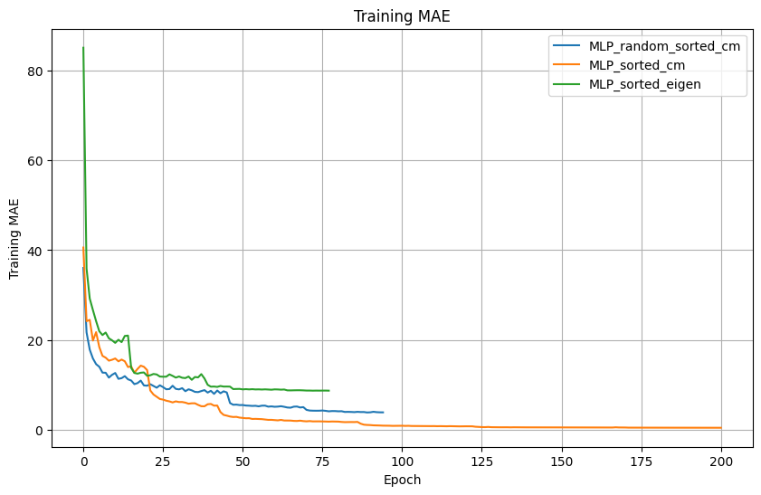
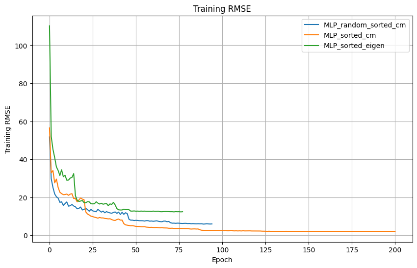
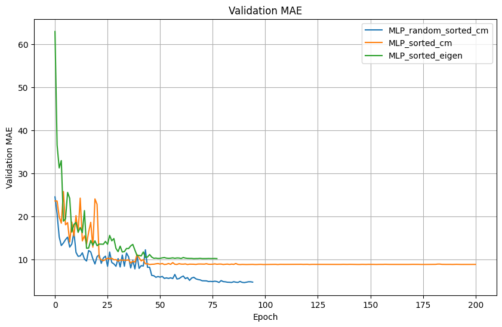
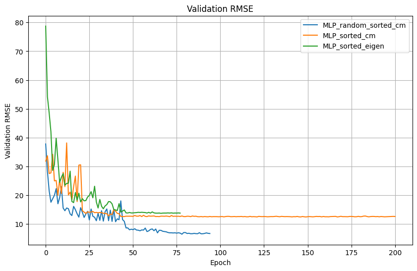
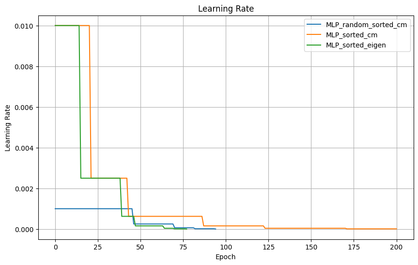

# Estimating Atomization Energies in the QM7 Dataset using Machine Learning

## Problem Statement

In this task, we aim to estimate the atomization energies of molecules in the QM7 dataset using various machine learning techniques. 

### Dataset Overview

- **Origin**: Subset of GDB-13, a database of nearly 1 billion stable and synthetically accessible organic molecules.
- **Composition**: 7,165 molecules with up to 23 atoms (7 heavy atoms from elements of C, N, O, S).
- **Features**:
  - **Coulomb Matrix Representation**: 
    - Diagonal elements: \( C_{ii} = \frac{1}{2}Z_i^{2.4} \)
    - Off-diagonal elements: \( C_{ij} = \frac{Z_iZ_j}{|R_i - R_j|} \)
    - Invariance: Built-in invariance to translation and rotation.
  - **Atomization Energies**: Ranging from -800 to -2000 kcal/mol.

- **Data Format**:
  - **X (7165 x 23 x 23)**: Coulomb matrices (input features).
  - **T (7165)**: Atomization energies (labels).
  - **P (5 x 1433)**: Cross-validation splits.
  - **Z (7165 x 23)**: Atomic charges.
  - **R (7165 x 3)**: Cartesian coordinates of each atom.

### Prior Work

Previous studies [1] and [2] have focused on learning the mapping between molecules and their atomization energies using the Coulomb Matrix (CM) as a molecular descriptor. Specifically, [2] builds on [1] by comparing several methods to enforce permutation invariance in the features:

1. **Sorted Eigenspectrum**: Computing the sorted eigenvalues of the CM.
2. **Sorted Rows and Columns**: Sorting the rows and columns of the CM by their respective norms.
3. **Random Sorting**: Augmenting the dataset by randomly sorting rows and columns to associate multiple Coulomb matrices with each molecule.

### Goals of the Current Study

1. **Replication**: Replicate the results of [2] by using the described permutation invariance methods with surveyed machine learning methods.
2. **Exploration of GNN**: Explore the use of Graph Neural Networks (GNNs) to learn from the raw representation of molecules as Cartesian coordinates and associated atomic charges.

### CM Features

#### Sorted Eigenvalues

Given a Coulomb matrix \( \mathbf{C} \), we have:
\[ \mathbf{C} \mathbf{v}_i = \lambda_i \mathbf{v}_i \]
where \( \lambda_i \) are the eigenvalues and \( \mathbf{v}_i \) are the corresponding eigenvectors. The eigenvalues are then sorted in descending order to form the feature vector:
\[ \text{sorted\_eigenvals}(\mathbf{C}) = \text{sort}(\{|\lambda_1|, |\lambda_2|, \ldots, |\lambda_n|\}) \]

These sorted eigenvalues could be used to represent molecules as they capture important properties of the matrix, and is invariant to permutation of atoms (i.e of rows and columns). 

However, the eigenvalues are not unique for each molecule. Consider the following two matrices:

\[ \mathbf{A} = \begin{pmatrix} 2 & 1 \\ 1 & 2 \end{pmatrix}  \mathbf{B} = \begin{pmatrix} 3 & 0 \\ 0 & 1 \end{pmatrix}\]

, which have the same eigenvalues of:

\[ \lambda_1 = 3, \quad \lambda_2 = 1 \]

<!-- Proof of invariant to permutation. Permute Matrix and SVD probably -->

#### Sorted Coulomb Matrices

For a Coulomb matrix \( \mathbf{C} \) with rows \( \mathbf{C}_i \):
\[ \left\|\mathbf{C}_i \right\| = \sqrt{\sum_{j} C_{ij}^2} \]
As \( \mathbf{C} \) is symmetric, both rows and columns are then sorted by the norm values in descending order for a unique representation for each molecule. 

<!-- Proof of unique representation for each molecule. Induction. -->

#### Randomly Sorted CM

With a Coulomb matrix \( \mathbf{C} \) and row norms \( \left\|\mathbf{C}_i \right\| \), we add noise to the norms before sorting to get different permutations:
\[ \left\|\mathbf{C}_i \right\|' = \left\|\mathbf{C}_i \right\| + \text{noise} \]
\[ \pi' = \text{argsort}(-\left\|\mathbf{C}_i \right\|') \]
Apply this permutation to rows and columns of \( \mathbf{C} \):
\[ \text{random\_C}_{ij} = \mathbf{C}_{\pi'(i) \pi'(j)} \]

This method aims to augment the dataset with advantage such that to unlearn pattern associated with sorting i.e the order in which atoms are listed.

## Classical ML Methods

### K-Nearest Neighbor

The K-Nearest Neighbor (KNN) algorithm is a non-parametric method used for regression. It predicts the target value of a new sample based on the mean (or mode) of the k-nearest neighbors in the training set.

#### Mathematical Formulation
For a given query point \( x \), the predicted atomization energy \( \hat{y} \) is given by:
\[ \hat{y} = \frac{1}{k} \sum_{i \in \mathcal{N}(x)} y_i \]
where \( \mathcal{N}(x) \) represents the set of k-nearest neighbors of \( x \) and \( y_i \) is the target value of neighbor \( i \).

### Linear Regression

Linear Regression assumes a linear relationship between the input features and the target variable.

\[ \hat{y} = \mathbf{X} \mathbf{w} + b \]
where \( \mathbf{X} \) is the feature matrix, \( \mathbf{w} \) is the weight vector, and \( b \) is the bias term.

### Kernel Ridge Regression

Kernel Ridge Regression (KRR) combines Ridge Regression with kernel trick, allowing it to perform in higher-dimensional space defined by the kernel.

#### Mathematical Formulation
KRR solves the following optimization problem:
\[ \min_{\mathbf{w}} \left( \sum_{i=1}^N (y_i - \mathbf{w}^T \phi(x_i))^2 + \alpha \|\mathbf{w}\|^2 \right) \]
where \( \phi(x) \) is the feature mapping induced by the kernel, \( \alpha \) is the regularization parameter, and \( \|\mathbf{w}\| \) is the norm of the weight vector.

#### Relevant Parameters
- `alpha`: Regularization strength.
- `gamma`: Kernel coefficient for 'rbf' (radial basis function).

#### Radial Basis Function (RBF) Kernel
The RBF kernel is defined as:
\[ K(x, x') = \exp\left(-\frac{\|x - x'\|^2}{2\sigma^2}\right) \]
where \( \|x - x'\| \) is the Euclidean distance between two points and \( \sigma \) is a free parameter. The RBF kernel is known for its ability to handle non-linear relationships.

### Support Vector Regression

Support Vector Regression (SVR) uses the principles of Support Vector Machines to perform regression, balancing model complexity with the tolerance for errors within a certain margin.

#### Mathematical Formulation
SVR solves the following optimization problem:
\[ \min_{\mathbf{w}, b, \xi, \xi^*} \frac{1}{2} \mathbf{w}^T \mathbf{w} + C \sum_{i=1}^N (\xi_i + \xi_i^*) \]
subject to:
\[ y_i - (\mathbf{w}^T \phi(x_i) + b) \leq \epsilon + \xi_i \]
\[ (\mathbf{w}^T \phi(x_i) + b) - y_i \leq \epsilon + \xi_i^* \]
\[ \xi_i, \xi_i^* \geq 0 \]
where \( \phi(x) \) is the feature mapping, \( \epsilon \) is the margin of tolerance, and \( \xi, \xi^* \) are slack variables.

#### Relevant Parameters
- `C`: Regularization parameter.
- `epsilon`: Epsilon-tube within which no penalty is associated with the training loss function.
- `gamma`: Kernel coefficient for 'rbf'.

## Results

### Performance Comparison

| Model                   | Mean Absolute Error (MAE) |
|-------------------------|---------------------------|
| Linear Regression       | 29.08                      |
| K-Neighbors Regressor(n_neighbors=3, p=1, weights='distance')       | 12.67                      |
| Kernel Ridge Regression (alpha=0.0004, gamma=0.01, kernel='rbf') | 10.07                      |
| Support Vector Regression (C=10000.0, epsilon=1.0) | 9.80                    |

## Multi-Layer Perceptron

### Architecture Overview 

In this section, we describe the architecture of our MLP to estimate atomization energies from the QM7 dataset adapted to different features. Thus, it comprises three main components: the input preprocessor, the multi-layer perceptron (MLP), and the output postprocessor.

#### Input Preprocessor

The input preprocessors transform the input Coulomb Matrix into chosen feature (Sorted Eigenvalues, Sorted Coulomb Matrices, Randomly Sorted Coulomb Matrices). The logic of the three transformations has been explained above. We also normalize the feature with mean and standard deviation calculated from the training set. 

However, for Randomly Sorted Coulomb Matrix, we apply an additional step of expanding a matrix into multiple features by applying a series of hyperbolic tangent functions at regular intervals as explained in [2]. 

#### Core Network

The core of the model is a typical Multi-Layer Perceptron (MLP) that maps the processed input features to the predicted atomization energies. It includes two hidden layers with each one followed by an activation function (e.g., sigmoid, tanh, or ReLU) to introduce non-linearity.

#### Output Postprocessor

The output postprocessor transforms the network's raw output back to the original scale. The params are determined during layer initialization using the mean and standard deviation of the target values from the training set.

#### Training Process

Because the lack of test set, we decide not to interact with the validation set during training. Instead, we use the training loss for learning rate scheduler and early stopping callback. While this approach carries the risk of overfting, we are allowed to report the validation test as test result in return. 

### Result

Due to time constraint, we are only able to report result on training of fold 0 of the QM7 dataset. The train and val loss with respect to epoch are shown below:

| Model                  | TEST_MAE | TEST_RMSE |
|------------------------|----------|-----------|
| MLP_random_sorted_cm   | 4.6658   | 6.7774    |
| MLP_sorted_cm          | 8.7802   | 12.5981   |
| MLP_sorted_eigen       | 10.1371  | 13.8153   |

The results generally agrees with result of [2], with sourted eigenvalues approach and sorted coulomb matrices achieved slightly better result but randomly sorted coulmb matrices had sligtly worse. We also note that our training process places less effort on tuning learning rate compared to [2].  

### Graph Neural Network

#### Data

In our approach, we use the molecular structure instead of a matrix to extract features. Specifically, we extract the positional and charge information from the dataset, i.e one-hot encoding the charge and concat with the value for the feature `data.x` and coordinate in `data.pos`. 

We use transformations from PyTorch Geometric to dynamically create edge indices and other features for the graph neural network. Below are some representative transformations:

**KNNGroupWithPos**

We construct the edge indices of the molecular graph using k-nearest neighbors (k-NN) based on the positional information of the atoms `data.pos`, with the fallback of default existing features `data.x`.

**CoulombGroupTransform**

More advanced transformation involves computing pairwise Coulomb forces between atoms and constructs a graph based on the k-largest forces. It also adds the Coulomb forces as edge attributes.

**PruneZeroCharge**

We note that for GNN the number of atom is not required to be uniform. Thus we could try removing (padding) atoms with zero charge from the molecular graph, focusing on only atoms that contribute to the molecular properties being predicted.

### Custom GNN

### GATNet

### DimeNet

DimeNetPlusPlus Model introduced in [3]. 

Test MAE:
DimeNet: 2.0417

Test RMSE :
DimeNet: 3.5544

## References

[1] M. Rupp, A. Tkatchenko, K.-R. Müller, and O. A. Von Lilienfeld, “Fast and Accurate Modeling of Molecular Atomization Energies with Machine Learning,” Phys. Rev. Lett., vol. 108, no. 5, p. 058301, Jan. 2012, doi: 10.1103/PhysRevLett.108.058301.
[2] G. Montavon et al., “Learning Invariant Representations of Molecules for Atomization Energy Prediction,” in Advances in Neural Information Processing Systems, Curran Associates, Inc., 2012. Accessed: Jun. 03, 2024. [Online]. Available: https://proceedings.neurips.cc/paper/2012/hash/115f89503138416a242f40fb7d7f338e-Abstract.html
[3] J. Gasteiger, S. Giri, J. T. Margraf, and S. Günnemann, “Fast and Uncertainty-Aware Directional Message Passing for Non-Equilibrium Molecules.” arXiv, Apr. 05, 2022. doi: 10.48550/arXiv.2011.14115.
